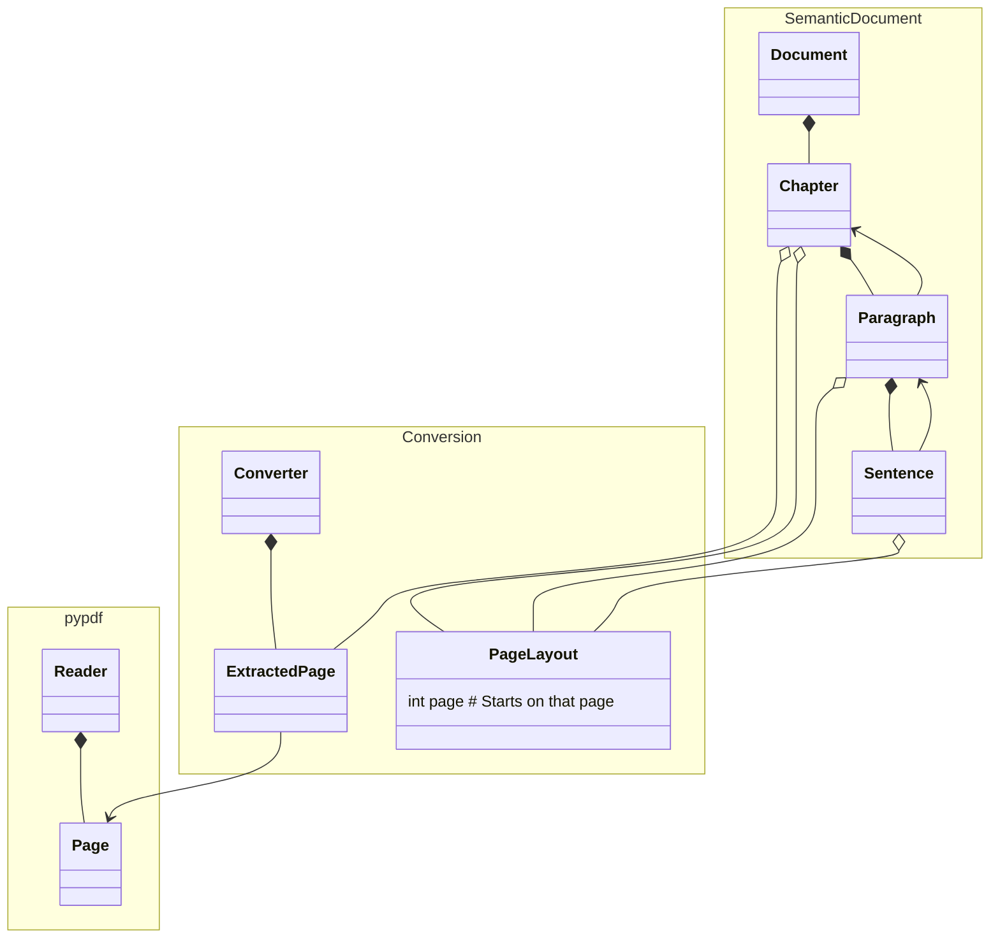

# PDF to Markdown

A Python package for converting PDF documents to Markdown format.

## Installation

```bash
pip install git+https://github.com/EricBoix/pdf-to-markdown.git
```

## Usage

```python
from pdf_to_markdown import ConverterBase, DocumentBuilder, TextExtractor
```

## Converting a new PDF

Extracting structure from PDFs requires inferring regex patterns for chapters, sub-chapters, figures, etc.

1. Print raw PDF text using `pdf_to_markdown.print_document_raw_pages()`
2. Explore the raw output to identify structural patterns
3. Test patterns with [regex101](https://regex101.com/) (select Python)
4. Implement patterns using `pdf_to_markdown.Splitter`

## Model class diagram



## References

### Recovering document structure from PDF

- Reddit post on [How to recover document structure and plain text from PDF?](https://www.reddit.com/r/LocalLLaMA/comments/1am3fz8/how_to_recover_document_structure_and_plain_text) with a focus on RAG applications.
- PDFMiner.six [explanations of how difficult extracting text from pdf can be](https://pdfminersix.readthedocs.io/en/latest/topic/converting_pdf_to_text.html)

### Converting PDF to markdown

<https://medium.com/data-science-collective/convert-pdfs-to-markdown-using-local-llms-c5232f3b50fc>
