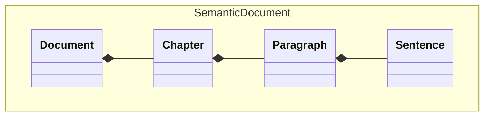

# PDF to Markdown

A Python package for converting PDF documents to Markdown format.

## Installation

```bash
pip install git+https://github.com/EricBoix/pdf-to-markdown.git
```

## Usage

```python
from pdf_to_markdown import ConverterBase, DocumentBuilder, TextExtractor
```

## Converting a new PDF

Extracting structure from PDFs requires inferring regex patterns for chapters, sub-chapters, figures, etc.

1. Print raw PDF text using `pdf_to_markdown.print_document_raw_pages()`
2. Explore the raw output to identify structural patterns
3. Test patterns with [regex101](https://regex101.com/) (select Python)
4. Implement patterns using `pdf_to_markdown.Splitter`

## Model


